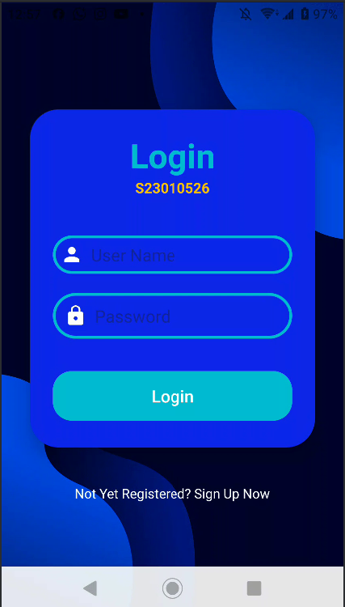
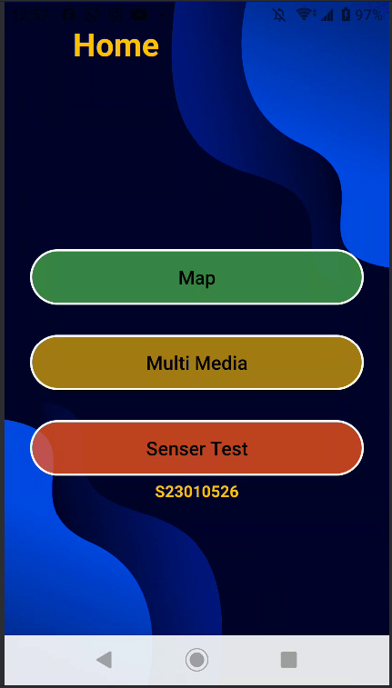
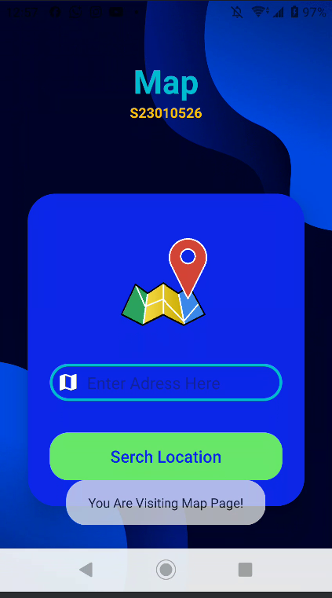
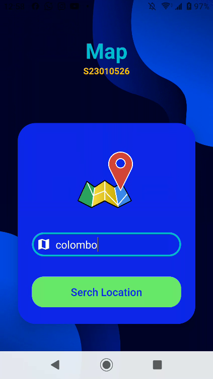
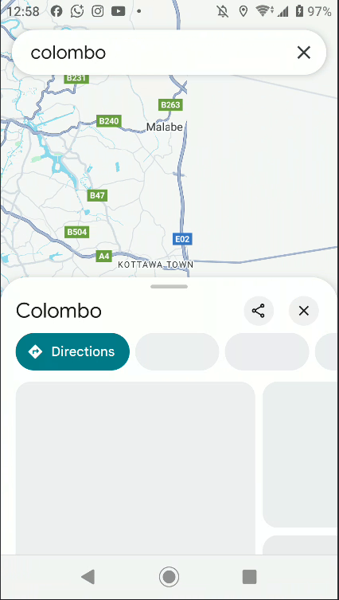
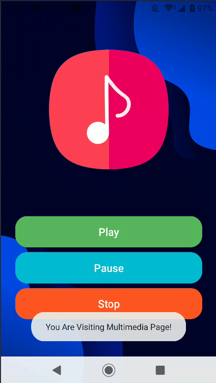
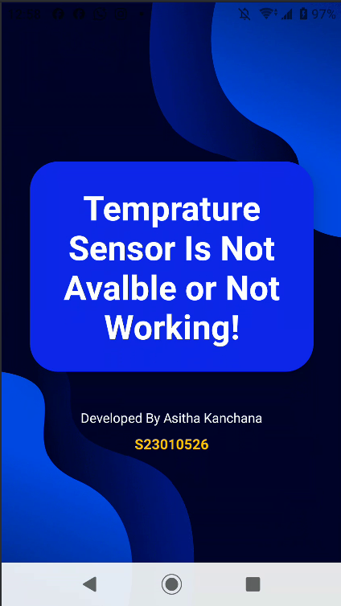
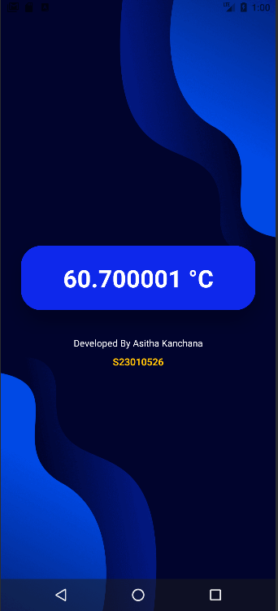
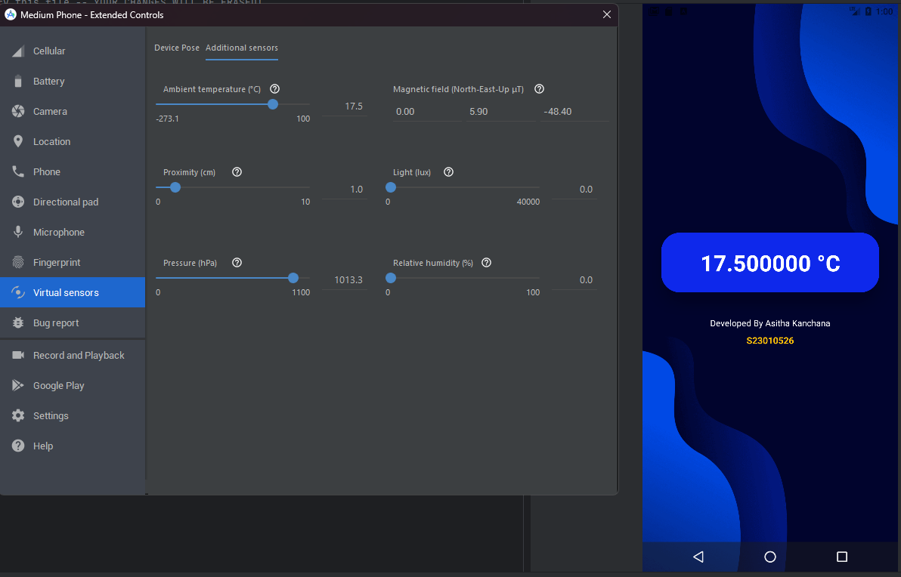

# EEI4369 - Mobile Application Development Lab Test

This repository contains the Android project for the **EEI4369 - Mobile Application Development for Android** lab test for the 2024/2025 academic year. The application integrates all five lab tasks into a single, cohesive Android project built with Java.

**IMPORTENT**
GOOGLE MAP API KEY IS NOT INCLUDET NEED TO ADD THEM MANUALY
More Instructions are Avalable in **Installation and Setup Section**
## ✨ Features

* **Task 1 & 2: Login Interface & Multimedia:** A functional login screen that serves as the app's entry point, and after featuring multimedia elements in Multimedia Page
* **Task 3: Google Maps Integration:** A map screen where users can input an address, which is then located and displayed on the map using geocoding.
* **Task 4: Sensor Integration:** An activity that uses the device's ambient temperature sensor to trigger an audio clip when a specific temperature threshold is exceeded. for **my Specipic Treshold is 26**.
* **Task 5: SQLite Database:** The login credentials from the first screen are validate using local SQLite database, with a confirmation message displayed to the user.
* **Unified Navigation:** All activities are connected in a logical flow: <br>
`Login -> Home-> Sensor Activity`<br>
`-------> Home-> Map`<br>
`-------> Home-> Multimedia`<br>


## 📸 Screenshots

Here's a gallery of the key features of the application.

| Login Screen (Task 1, 2 & 5) | Google Maps (Task 3) | Sensor & Multimedia (Task 4) |
|:----------------------------:|:--------------------:|:------------------------------:|
|  |  |  |
|  |  |  |
|  |  |  |
###  Techonologies 
- java
- SQLite
- 

## 🛠️ Getting Started ----- **IMPORTENT**------

Follow these instructions to get a copy of the project up and running on your local machine for development and testing purposes.

### Prerequisites

* Android Studio (latest version recommended)
* An Android Virtual Device (AVD) with Google Play Services enabled (required for Google Maps) or a physical Android device.

### ⚙️ Installation and Setup

1. **Clone the Repository**
    
    ```bash
    git clone https://github.com/AsithaKanchana1/lab-activity-android-1.git
    ```

    [GIT Clone](https://github.com/AsithaKanchana1/lab-activity-android-1.git)

2. **Open the Project**
    * Open Android Studio.
    * Select `File > Open` and navigate to the cloned project directory.
    * Allow Gradle to sync and build the project dependencies. This may take a few minutes.

3.  **Add Google Maps API Key**

    The Google Maps API Key is intentionally not included in the source code for security reasons. To enable map functionality, you must add your own API key.

    * In the root directory of the project, find or create a file named 
    
    ```powershell
    local.properties
    ```
    
    * Inside your `local.properties` file, create a variable named 
    
    ```powershell
    MAPS_API_KEY
    ``` 
    
    and assign your API key to it, as shown below. The project is already configured to read this key from the file.

    ```bash
    MAPS_API_KEY="YOUR_GOOGLE_MAPS_API_KEY"
    ```
    
    * Save the file and sync the Gradle project if prompted. The project will now work with all map functionalities enabled.

## 🚀 Running and Testing the Application

Once the setup is complete, you can run the application on your emulator or physical device. The app will guide you through the features in the following order:

### 1. Login & Database Test (Tasks 2 & 5)
* The first screen is the Login UI.
* Enter any text into the `Username` and `Password` fields.
* Click the **Login** button.
* **Verification:**
    * A `Toast` message will appear at the bottom of the screen confirming that the data has been successfully saved to the SQLite database.
    * The app will automatically navigate to the Map screen.

    Since there are no Sinup Page I have added  some Sample Data to Data Base Following Data will work as `Valid User Name `and `Password`
#### 1st Values

    User Name 

    ```bash
    Asitha
    ```
    Password 

    ```bash
    2025
    ```

#### 2nd Values

    User Name 

    ```bash
    Kanchana
    ```
    Password 

    ```bash
    1234
    ```

### Home Page 
Lab instructions didn't talk about home screen but i have implimented it becouse that way navigations are easyer so
all the other lab activity linked to Home Page 

### 2. Google Maps Test (Task 3)

* On Home screen You can see Map Button after clicking map button you will Rederect to New Interface and you can use search location funtion and  you will see the Google Maps interface.
* In the `Enter Address` text field, type a valid location (e.g., "Eiffel Tower" or a full address).
* Click the **Show Location** button.
* **Verification:** The map camera will animate and center on the coordinates corresponding to the address you entered.

### 3. Sensor Test (Task 4)
* Inside Home Page You Can see Senser Test Button and by clicking the button you will rederect to new interface that mainly focus on Temprature Sensor and when Temprature is Over 26 it willl play Music You Can Testout it
* This feature is designed to be tested using the **virtual sensors** in the Android Emulator.
* **Testing Steps:**
    1.  With the app running in the emulator, click the three dots (`...`) in the emulator's side panel to open the **Extended Controls**.
    2.  Navigate to the **Virtual Sensors** tab.
    3.  Find the **Ambient temperature** slider.
    4.  The temperature threshold for this project is set based on the student's SID (e.g., for `S92075210`, the threshold is `10` °C).
    5.  Slowly drag the slider to increase the temperature.
* **Verification:** When the emulated temperature rises **above** the set threshold, you will hear an audio clip play automatically.
